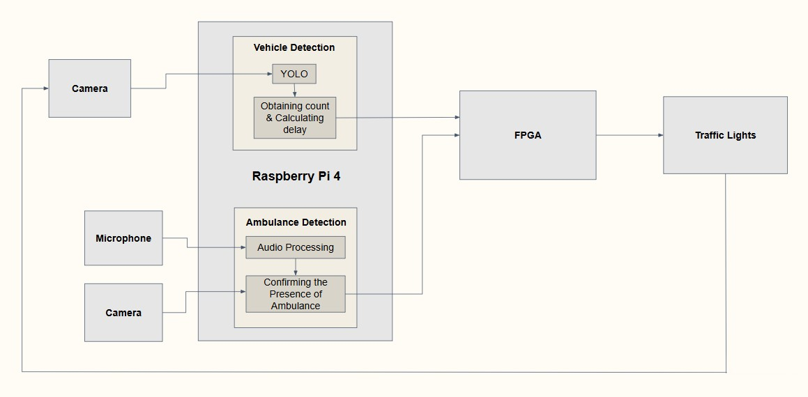
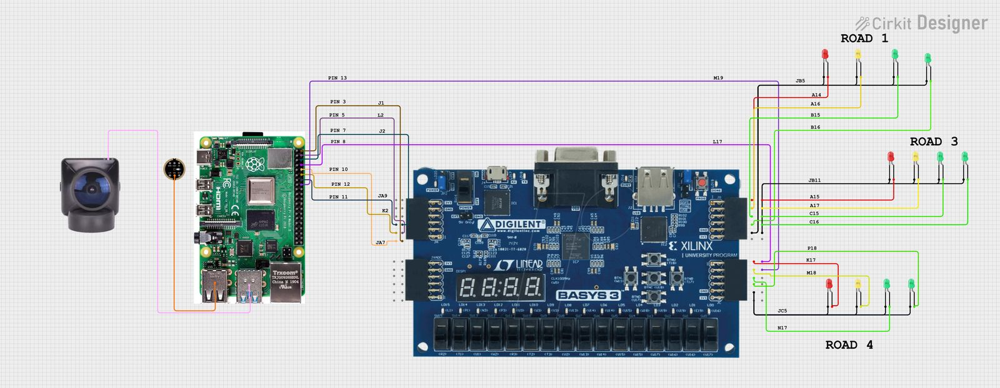

# Smart Traffic Management System

A system to manage traffic at intersections by detecting vehicles and prioritizing emergency vehicles (like ambulances) using Raspberry Pi, FPGA, and computer vision.

## About the Project
This project solves traffic jams and helps emergency vehicles (like ambulances) pass intersections faster. It uses:
- A webcam to count vehicles with YOLO (a computer vision tool).
- A microphone to detect ambulance sirens with YAMNet.
- Raspberry Pi to process data.
- FPGA to control traffic lights in real-time.

We built and tested it on a small model of a traffic junction at Mar Baselios College of Engineering and Technology (2025).

## Features
- Counts vehicles to adjust green light times for busy roads.
- Detects ambulance sirens and gives them priority (green light).
- Uses FPGA for fast and reliable traffic light control.

## Technologies Used
- **Hardware**: Raspberry Pi 4, Basys 3 FPGA, Webcam, Microphone, LED Traffic Lights.
- **Software**: Python, Verilog, YOLOv8, YAMNet, OpenCV, PyAudio.
- **Tools**: Git, Vivado (for FPGA), TensorFlow Lite.

## How It Works
1. Webcam captures traffic and YOLO counts vehicles.
2. Microphone listens for sirens and YAMNet confirms if it’s an ambulance.
3. Raspberry Pi processes the data and sends instructions to the FPGA.
4. FPGA changes traffic lights to reduce congestion or prioritize ambulances.



## Setup Instructions
1. Clone the project:
   ```bash
   git clone https://github.com/your-username/Smart-Traffic-Management-System.git
   cd Smart-Traffic-Management-System
2. Install Python libraries
3. Add YOLO and YAMNet models to models/
4. Program the FPGA with src/verilog/fpga_blink_new.v using Vivado.
5. Run the main script
    python src/python/traffic_control.py

Results
-Successfully controlled traffic lights based on vehicle count.
-Detected ambulances using siren sounds and video.
-Tested on a mini traffic junction model.
-Challenge: Audio processing was hard on Raspberry Pi, so we tested it separately on a laptop.    

Demo
- 🎥 Watch the Demo Video (https://drive.google.com/file/d/11muLq86sJkHUUcLF9veugZjnzbw4sB4t/view?usp=drivesdk)


##Documentation
-Project Report
-Circuit Diagram

## License
This project is licensed under the MIT License - see [LICENSE](LICENSE).

*Created by students at Mar Baselios College of Engineering and Technology, 2025.*
